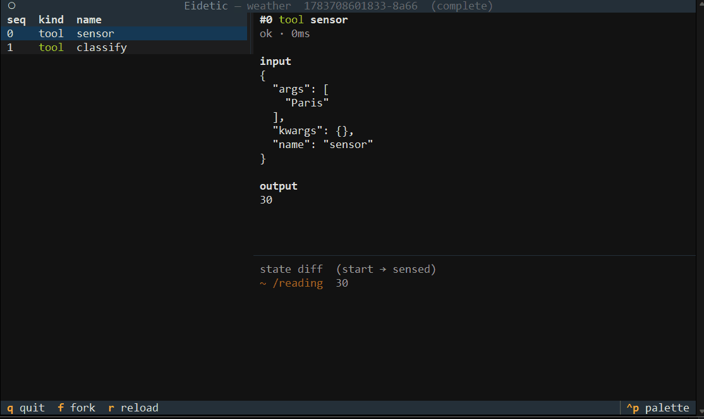

# Kinescope

*(formerly Eidetic)*

> `rr` for nondeterministic AI agents — capture every nondeterministic input so any run replays deterministically, *and* can be branched: "what if the model had chosen the other tool here?"

Kinescope records the **nondeterministic frontier** of an agent (LLM calls, tool calls, clock, RNG/UUID, retrieval), replays any run **deterministically** from the trace, and lets you **fork** at any step — override one recorded event and resume *live* — to explore counterfactuals. A Textual timeline lets you scrub steps, inspect message/tool I/O and state diffs, and fork with one key.

**The demo:** an agent fails a task; you scrub to the step where it picked the wrong tool, fork and override just that decision, and watch the branched run complete — fully reproducible from the recording.



*Fork-and-fix in the timeline TUI: override one recorded step, and the tail re-runs live. Reproduce it with `python examples/fork_demo_tui.py`.*

- **Local-first, pluggable:** traces live in `.kinescope/` (SQLite index + content-addressed blobs) by default — no external services; a `MongoStore` backend (`kinescope[mongo]`) drops in via the same `TraceStore` port.
- **Tiny core:** the engine depends on `httpx` only; `anthropic`, `openai`, the CLI, the TUI, and Mongo are optional extras.
- **Provider-agnostic:** interception is at the httpx transport, so the *same* record→replay→fork engine drives **Anthropic** Messages, **OpenAI** Chat Completions, **Google Gemini** `generateContent` (a very different wire shape — model in the URL, not the body), and **local models via Ollama**. Only the `gen_ai.*` metadata normalization differs (`src/kinescope/adapters/`).
- **Proven on real calls:** two genuine runs are recorded and committed as bundles that replay **offline, bit-for-bit** in CI — a hosted **Anthropic** call (`examples/fixtures/real_anthropic_run.zip`) and a **local Ollama** model (`examples/fixtures/real_ollama_run.zip`, no key, no network). Regenerate with `python examples/live_record.py` / `python examples/live_ollama_record.py`.
- **Interoperable:** event metadata follows the **OpenTelemetry GenAI** conventions, so any recorded run exports as `gen_ai.*` spans (`kinescope export-otel`) into existing observability backends (Phoenix, Langfuse, …).

**Status:** **feature-complete** — deterministic record→replay across the full nondeterministic frontier (LLM calls — sync, async, SSE streaming; `@kinescope.tool` calls; opt-in clock/RNG/UUID), an honest divergence detector, state snapshots with per-step diffs, **counterfactual branching** (`fork` at any step, override one event, run the tail live), a **timeline TUI**, a full **CLI runner** (`record`/`replay`/`fork` your agent script), three providers (Anthropic, OpenAI, Gemini), a **real recorded Anthropic run** that replays offline, OpenTelemetry export, a MongoDB backend, and shareable trace bundles. 62 offline tests. See [ROADMAP.md](ROADMAP.md) and [PROGRESS.md](PROGRESS.md).

---

## Run it

**Prerequisites:** Python ≥ 3.11 (check: `python --version`).

```bash
py -m venv .venv
source .venv/Scripts/activate      # Windows Git Bash; use `.venv/bin/activate` on macOS/Linux
pip install -e ".[dev]"            # core + anthropic + openai + cli + tui + otel + test tooling
python examples/fork_demo.py       # the flagship fork-and-fix loop (cold -> warm)
```

(A `Makefile` offers `make demo` / `make test` / `make lint` shortcuts if you have `make`.)

Run the examples end-to-end (offline — no API key, no network):

```bash
python examples/record_demo.py     # records one Anthropic call, then replays it deterministically
python examples/tool_agent.py      # a tool + clock + RNG + LLM agent, recorded and replayed
python examples/stateful_agent.py  # snapshots state across steps, then diffs it
python examples/fork_demo.py       # fork-and-fix: override one step, watch the outcome change
python examples/fork_demo_tui.py   # the same, in the timeline TUI — scrub, then press 'f'
python examples/openai_demo.py     # the same engine recording a second provider (OpenAI)
python examples/otel_export.py     # export a recorded run as OpenTelemetry gen_ai spans
python examples/share_bundle.py    # export a run to a zip, import it elsewhere, replay it
```

Inspect and drive recorded runs from the CLI:

```bash
kinescope record -- python your_agent.py            # record an agent script (uses kinescope.http_client())
kinescope replay <run-id> -- python your_agent.py   # replay it deterministically
kinescope fork <run-id> --at 3 --override '{"output": 72}' -- python your_agent.py  # counterfactual
kinescope ls                         # list recorded runs (with fork lineage)
kinescope show <run-id> [--step k]   # inspect a run's events and I/O
kinescope diff <run-id> <a> <b>      # state diff between two steps
kinescope ui <run-id>                # scrub the timeline TUI (view-only)
kinescope export-otel <run-id>       # emit OpenTelemetry gen_ai.* spans to the console
kinescope export <run-id> run.zip    # package a run into a shareable bundle; `kinescope import run.zip`
```

`record`/`replay`/`fork` run your agent *script* (which builds its client with `kinescope.http_client()`) in-process under a session — try it offline with `examples/agent_script.py`.

### The timeline (TUI)

`kinescope ui <run-id>` opens a three-pane timeline — steps · detail · state diff — that you
scrub with ↑/↓. Launched with an agent (`kinescope.ui(run_id, agent=run_agent)`), `f` forks the
highlighted step, overrides its output, and runs the tail live — the fork-and-fix loop shown
in the gif above ([static frame](docs/timeline.svg)):

```
┌ Kinescope ── weather#fork@0  …  ⑂ from <parent>@0 ───────────────────────────────────┐
│ seq kind  name        │ #1 tool classify              │ state diff (sensed → …)     │
│  0  tool  sensor  fork│ ok · 0ms                      │ ~ /verdict   "warm"         │
│ ▸1  tool  classify    │ input  [72]                   │                             │
│                       │ output "warm"                 │                             │
└ ↑/↓ scrub · f fork · q quit ───────────────────────────────────────────────────────┘
```

Both examples use the real Anthropic SDK wired through a Kinescope transport with a stub
inner transport, so they record and replay with no network and no key — and replay
provably never touches the network.

### Use it in your own agent

```python
import anthropic, kinescope

@kinescope.tool                              # tool calls are recorded boundaries
def get_weather(city: str) -> dict:
    ...

def run_agent():
    client = anthropic.Anthropic(http_client=kinescope.http_client())
    msg = client.messages.create(
        model="claude-opus-4-8", max_tokens=256,
        messages=[{"role": "user", "content": "What's the weather in Paris?"}],
    )
    return msg

# capture=[...] also records direct clock/RNG/UUID use (opt-in; off by default)
with kinescope.record("paris", capture=["clock", "rng"]) as rec:
    run_agent()

with kinescope.replay(rec.run_id) as rep:    # reproduce, offline & deterministic
    run_agent()
assert not rep.divergences

# counterfactual: override step k's output, then run the tail LIVE
with kinescope.fork(rec.run_id, at=3, override={"output": {"temp_f": 71}}) as branch:
    run_agent()                            # steps 0–2 replay; step 3 is overridden; 4+ go live
print(branch.run_id)                       # a new child run, linked to its parent
```

For async agents use `kinescope.async_http_client()` with `anthropic.AsyncAnthropic`.
Streaming (`messages.stream(...)`) is captured and replayed automatically.

### Commands

| Command | What it does |
|---|---|
| `python examples\record_demo.py` | Run the offline record→replay demo |
| `kinescope ls` | List recorded runs |
| `kinescope show <id> [--step k]` | Inspect a run's events / per-step I/O |
| `pytest` | Run the tests |
| `ruff check . && mypy src` | Lint + typecheck |

---

## How to give feedback

You mainly **test and report**:

- Describe what happened in plain language.
- Paste any errors verbatim (the single most useful thing).
- Screenshots for anything visual (the TUI, once it lands).

Every milestone in [ROADMAP.md](ROADMAP.md) ends with explicit **Test** steps.

---

## Project docs

| Doc | What's in it |
|---|---|
| [DESIGN.md](DESIGN.md) | The full design and rationale — the single source of truth. |
| [ROADMAP.md](ROADMAP.md) | The milestone checklist (the plan + what's done). |
| [PROGRESS.md](PROGRESS.md) | Build log: what shipped each milestone and why. |
| [`docs/`](docs/) | Deeper docs and architecture decisions (ADRs). |
| [Eidetic-Foundational-Doc.md](Eidetic-Foundational-Doc.md) | The original thesis the design grew from (written under the project's original name, Eidetic). |

## Determinism, honestly (limitations)

Determinism is guaranteed **at recorded boundaries**, and leaks are *surfaced*, not hidden — the divergence detector flags input/order/count mismatches (`strict` raises, `warn` continues). Known limits:

- **One recording context per run.** The active session is a contextvar, so boundaries on worker threads that don't inherit it are **not captured** — and since they never enter the sequence, the detector can't flag them. Single-thread or `asyncio` (tasks inherit the context) is the supported model.
- **Concurrent boundary ordering** (`asyncio.gather`) may differ between record and replay; when it does, replay is **flagged, never silently wrong**.
- **Streaming replays batched** — SSE is reproduced by content, not re-timed.
- **Clock/RNG capture is opt-in** (`record(capture=[...])`); it monkeypatches `time`/`random`/`uuid`, so library calls to those are captured too (and replay deterministically as long as the library's call pattern is stable).
- **Throughput:** inline (clock/RNG) events record at ~20k–190k/s (cache-warmth dependent) and replay faster — 10k events record+replay in well under a second; tool/LLM events are bound by per-payload blob writes (~1k/s for distinct payloads; identical payloads dedup for free).

## Tech stack

Python 3.11+ · `httpx` transport interception · Anthropic / OpenAI / Gemini adapters · SQLite + content-addressed blobs (or MongoDB via the same port) · Typer (CLI) · Textual (TUI) · OpenTelemetry export. Hexagonal/ports-and-adapters around a deterministic core.

## License

MIT — see [LICENSE](LICENSE).
